# Push Notifications with Firebase Cloud Messaging (FCM) in Android apps

## Introduction

Firebase Cloud Messaging (FCM) is a powerful service provided by Google that allows you to send push notifications to Android, iOS, and web applications. FCM provides several key functionalities for push notifications:

- **Cross-Platform Notifications:** FCM allows you to send notifications to multiple platforms, including Android, iOS, and web applications, using a single API.

- **Notification Delivery:** FCM handles the delivery of notifications to devices, even when the app is in the background or not running. It ensures that notifications reach their intended recipients efficiently.

- **Topic-Based Messaging:** You can subscribe devices to specific topics, allowing you to send notifications to a group of devices interested in a particular topic. Subscribing and unsubscribing from topics is flexible and easy to manage.

- **Token Management:** FCM assigns a unique registration token to each app instance on a device. You can use these tokens to target specific devices when sending notifications. Tokens are refreshed automatically when needed.

- **Custom Payloads:** FCM allows you to send custom data along with notifications. This data can be used to provide additional context or trigger specific actions when the notification is received.

- **Notification Types:**

  - **Notification Messages:** These are high-priority messages that FCM automatically displays to the user. You can include a title, body, and other optional data. Android handles the display of these messages.
  - **Data Messages:** These are messages with custom data payloads that don't trigger automatic display. Your app must handle the data and display the notification as needed.

- **Notification Channels:** On Android, you can categorize and prioritize notifications using notification channels. FCM supports creating and managing notification channels for Android apps.

- **Notification Analytics:** FCM provides analytics to track the performance of your notifications, such as the number of messages sent, delivered, opened, and more. This helps you evaluate the effectiveness of your messaging campaigns.

- **Notification Scheduling:** You can schedule notifications to be sent at a specific time, which is useful for sending reminders, updates, or other time-sensitive information.

- **Security:** FCM ensures that messages are sent and received securely. Messages are encrypted in transit, and authentication mechanisms prevent unauthorized access to your Firebase project.

- **Integration with Firebase Services:** FCM seamlessly integrates with other Firebase services, such as Firebase Authentication, Firebase Realtime Database, and Firebase Cloud Functions. You can trigger notifications based on events in these services.

- **Server-to-Device Messaging:** FCM allows server-side applications to send messages to specific devices directly. This is useful for sending personalized notifications based on user interactions or events.

- **Debugging Tools:** FCM provides debugging tools and logs to help you diagnose issues with message delivery or token registration.

- **Multi-Language Support:** You can send notifications in multiple languages, ensuring that users receive messages in their preferred language.

- **Notification Hubs:** FCM can be used in conjunction with Notification Hubs to send push notifications to Windows devices, extending the reach of your messaging to a wider audience.

Firebase Cloud Messaging (FCM) is a comprehensive solution for sending push notifications to mobile and web apps.In this tutorial, we will discuss only push notifications using Firebase.

## Android app connection process with Firebase

- **Step 1: Create a Firebase Project**

  - [Go](https://console.firebase.google.com/) to the Firebase Console.
  - Sign in with your Google account.
  - Click on "Add project" to create a new Firebase project or select an existing one.

- **Step 2: Add Your Android App to Firebase**
  - In your Firebase project, click on _Add app_ and select the Android platform.
  - Enter your Android app's package name (usually found in your app's `build.gradle` file).
  - Optionally, enter other details like the app nickname.
  - Click _Register app._
- **Step 3: Download and Add Configuration File**

  - After registering your app, download the `google-services.json` file.
    
  - Place the `google-services.json` file in the app directory of your Android project.

  

- **Step 4: Configure Your App's Build Gradle Files**

  - In your `build.gradle` files, you'll need to **add dependencies** and apply plugins.**Project-level build.gradle (usually found in the project's root directory):**

  ```kts
  plugins {
          // ...

          // Add the dependency for the Google services Gradle plugin
          id("com.google.gms.google-services")  version "4.4.0" apply false

  }

  ```

  

  - **App-level `build.gradle` (usually found in the app module):**

  ```kts
  plugins {
  id("com.android.application")

  // Add the Google services Gradle plugin
  id("com.google.gms.google-services")

  ...
  }


  dependencies {
  // Import the Firebase BoM
  implementation(platform("com.google.firebase:firebase-bom:32.3.1"))


  // TODO: Add the dependencies for Firebase products you want to use
  // When using the BoM, don't specify versions in Firebase dependencies
  // https://firebase.google.com/docs/android/setup#available-libraries
  }
  ```

  
  

## Enable process Firebase cloud messaging in Android app

**Tools > Firebase > Cloud Messaging**

1.  Connect your app to firebase
2.  Add FCM to your App

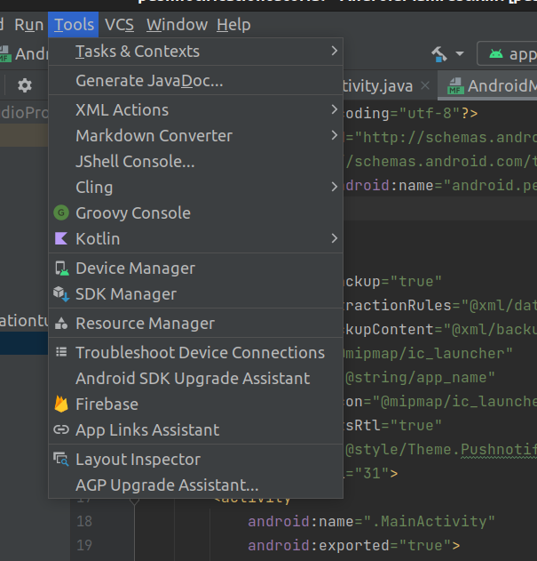
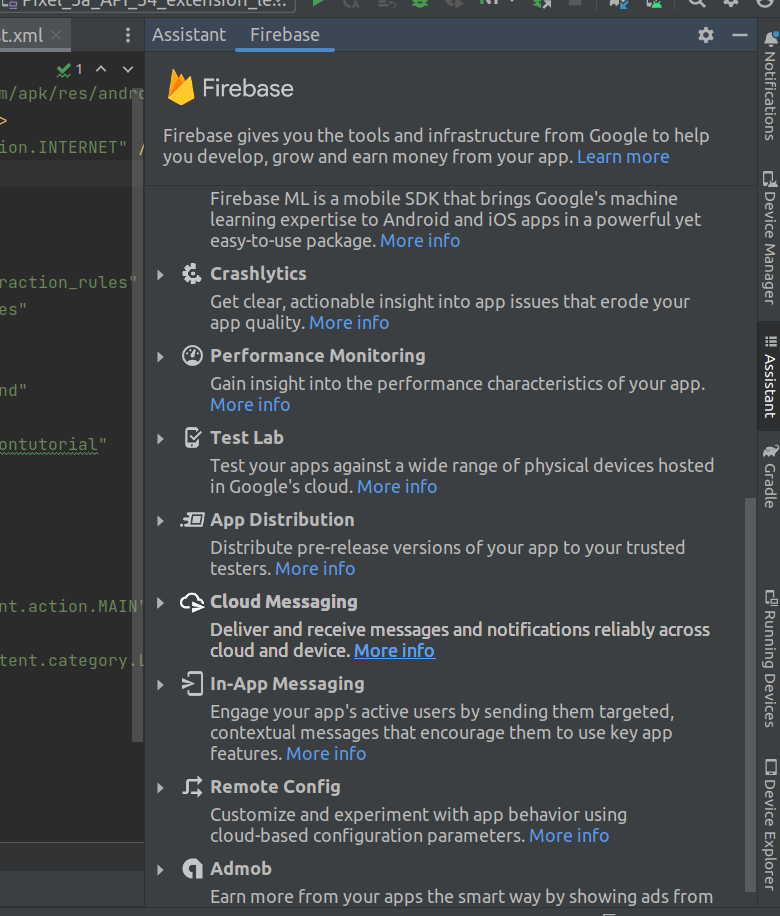
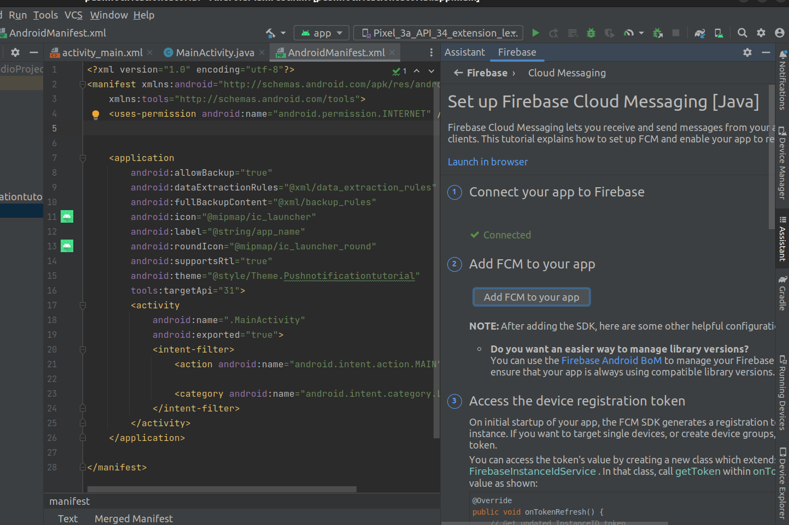

## Necessary Permissions for Notification in Android App

- **INTERNET:** Required for sending and receiving data from Firebase Cloud Messaging (FCM) servers.

- **WAKE_LOCK (optional):** This permission is used to ensure that the device remains awake while processing notifications, especially if you want to wake up the device to display notifications.

- **VIBRATE (optional):** Allows your app to vibrate the device when a notification is received.

You should include these permissions in your app's `AndroidManifest.xml` file as follows:

```xml
    <uses-permission android:name="android.permission.INTERNET" />
    <uses-permission android:name="android.permission.WAKE_LOCK" />
    <uses-permission android:name="android.permission.VIBRATE" />
    <uses-permission android:name="com.google.android.c2dm.permission.RECEIVE" />
```

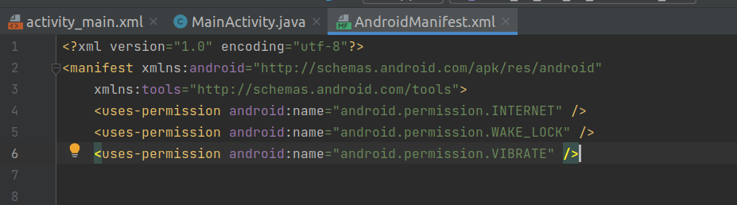

## Push Notification in Your app using Firebase Cloud messaging process step by step

- Initialize Firebase in your Application class (or in your main activity's onCreate method if you don't have a custom Application class):

```java
package com.example.pushnotificationtutorial;

import android.os.Bundle;
import android.view.View;
import android.widget.Button;
import androidx.appcompat.app.AppCompatActivity;

import com.google.firebase.FirebaseApp;

public class MainActivity extends AppCompatActivity {

    @Override
    protected void onCreate(Bundle savedInstanceState) {
        super.onCreate(savedInstanceState);
        FirebaseApp.initializeApp(this);
        setContentView(R.layout.activity_main);
    }
}

```

- Create a service to handle incoming FCM messages. Create a class called `MyFirebaseMessagingService.java`:
```java
package com.example.pushnotificationtutorial;
import android.app.NotificationChannel;
import android.app.NotificationManager;
import android.app.PendingIntent;
import android.content.Context;
import android.content.Intent;
import android.os.Build;
import androidx.core.app.NotificationCompat;
import com.google.firebase.messaging.FirebaseMessagingService;
import com.google.firebase.messaging.RemoteMessage;

public class MyFirebaseMessagingService extends FirebaseMessagingService {

    @Override
    public void onMessageReceived(RemoteMessage remoteMessage) {

            sendNotification(remoteMessage.getNotification().getTitle(), remoteMessage.getNotification().getBody());

    }

    private void sendNotification(String title, String messageBody) {
        // Create an Intent to open the main activity when the notification is tapped
        Intent intent = new Intent(this, MainActivity.class);
        intent.addFlags(Intent.FLAG_ACTIVITY_CLEAR_TOP);
        PendingIntent pendingIntent = PendingIntent.getActivity(this, 0, intent, PendingIntent.FLAG_ONE_SHOT | PendingIntent.FLAG_IMMUTABLE);

        String channelId = "default_channel_id"; // You can change this to your desired channel ID
        NotificationCompat.Builder notificationBuilder =
                new NotificationCompat.Builder(this, channelId)
                        .setSmallIcon(R.drawable.ic_notification)
                        .setContentTitle(title)
                        .setContentText(messageBody)
                        .setAutoCancel(true)
                        .setContentIntent(pendingIntent);

        NotificationManager notificationManager =
                (NotificationManager) getSystemService(Context.NOTIFICATION_SERVICE);

        // Create a notification channel (required for Android Oreo and above)
        if (Build.VERSION.SDK_INT >= Build.VERSION_CODES.O) {
            NotificationChannel channel = new NotificationChannel(
                    channelId,
                    "Default Channel",
                    NotificationManager.IMPORTANCE_DEFAULT
            );
            notificationManager.createNotificationChannel(channel);
        }

        notificationManager.notify(0 , notificationBuilder.build());
    }
}
```
- Register the MyFirebaseMessagingService in your `AndroidManifest.xml` file:
```xml
<service
    android:name=".MyFirebaseMessagingService">
    <intent-filter>
        <action android:name="com.google.firebase.MESSAGING_EVENT" />
    </intent-filter>
</service>

```
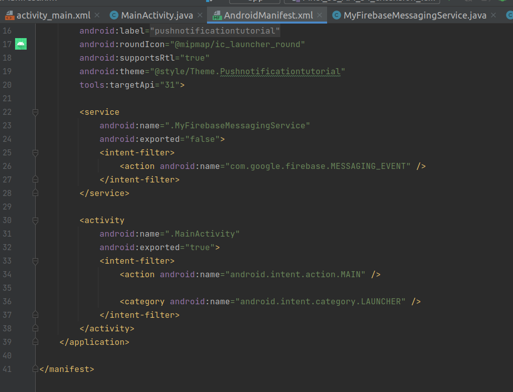

- Send a test notification from the Firebase Console to test your setup.
    + [Go](https://console.firebase.google.com) to Firebase Console.
    + Select your created project.
    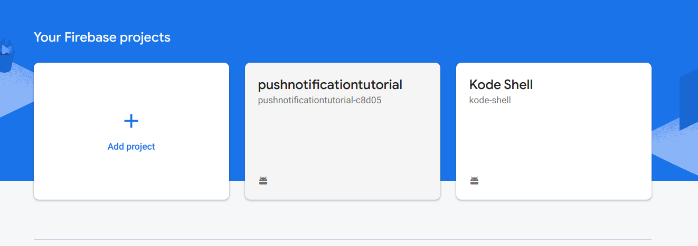
    + > Messaging > New campaing
    
        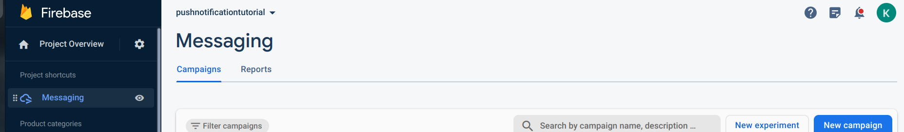
    + Compose a proper notification by adding title,text,image
      
      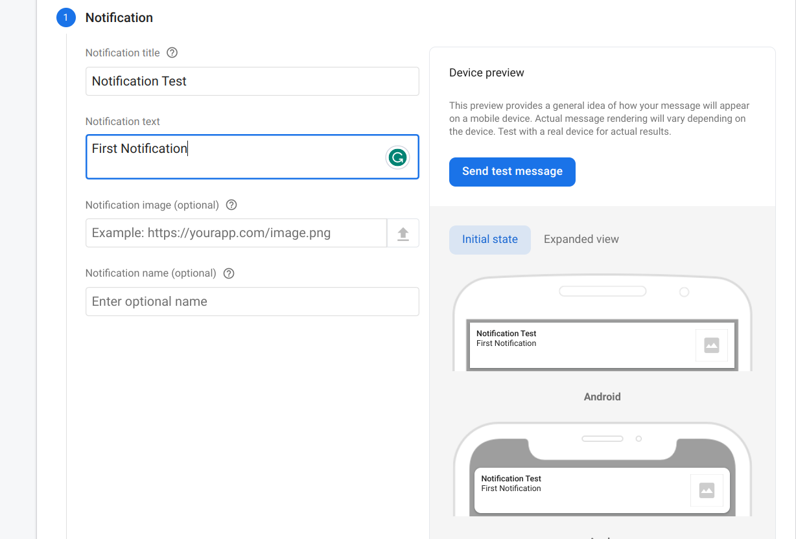
    
    + Select your app .
    
      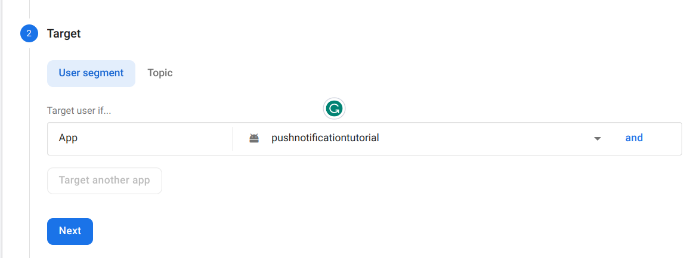
    
    + Add time.
    
      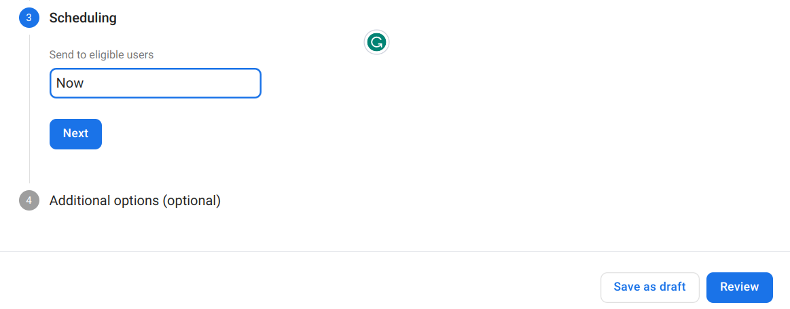

     + Finally Publish your notification.
      
       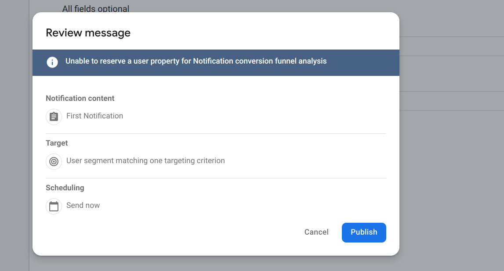 

- And finally, here we can see it worked successfully

***The result***
    
    
  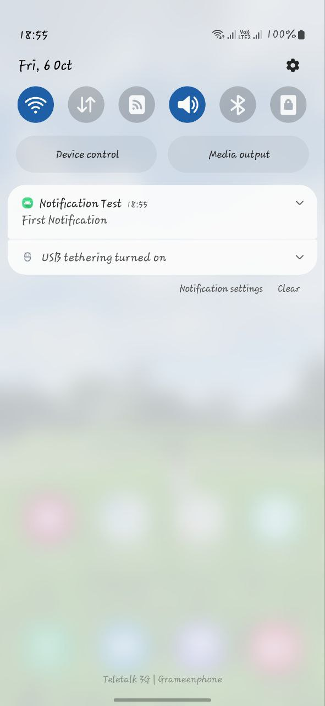


